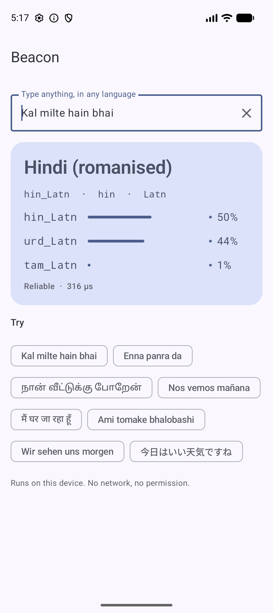
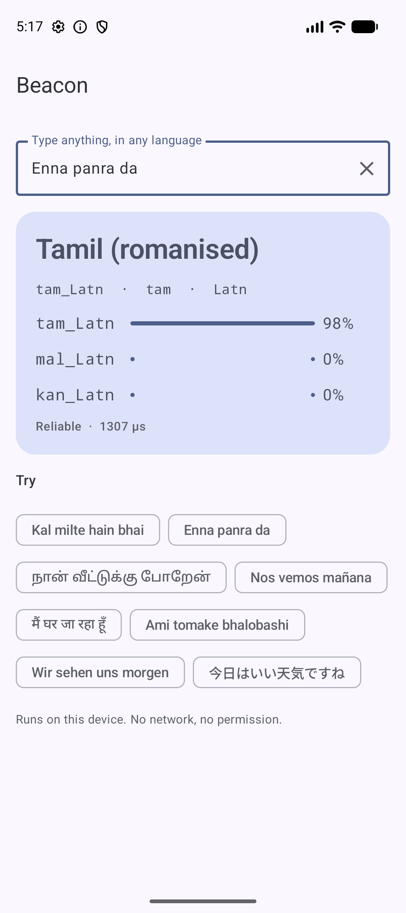
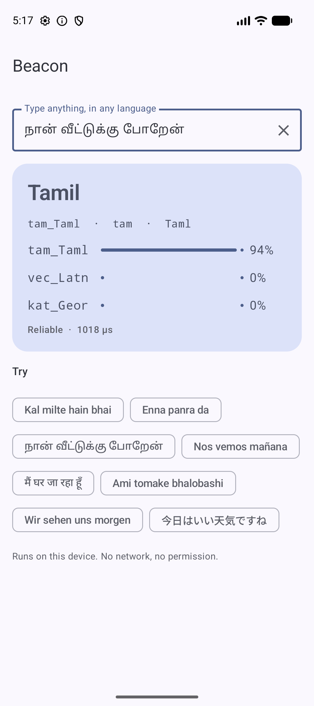

# Beacon 🗼

By Hoverfly. On-device language detection for Android. You give it any text, even a two-word chat message, and it tells you the language **and** the script. It also recognises romanised Indian languages like Hinglish and Tanglish.

```kotlin
import io.github.rajumark.hoverfly.beacon.Beacon

Beacon(context).use { beacon ->
    beacon.detect("Kal milte hain bhai").label   // "hin_Latn"  Hindi (romanised)
}
```

```
"Kal milte hain bhai"      → hin_Latn   Hindi (romanised)
"Enna panra da"            → tam_Latn   Tamil (romanised)
"நான் வீட்டுக்கு போறேன்"      → tam_Taml   Tamil
"Ami tomake bhalobashi"    → ben_Latn   Bengali (romanised)
"Nos vemos mañana"         → spa_Latn   Spanish
"😀 123"                    → und        (no letters to judge)
```

- **211 labels.** 195 language/script pairs, all 22 scheduled Indian languages, and 12 romanised South Asian languages (`hin_Latn`, `tam_Latn`, `urd_Latn`, `ben_Latn`, …).
- **No dependencies.** Inference is plain Kotlin. There is no ML Kit, TFLite or native code, so the library adds about 8.5 MB to an APK.
- **Private and offline.** The model ships inside the AAR. There is no network, no permission and no telemetry.
- **Fast.** About 0.08 ms per text on an Android emulator (Apple silicon), ~35 µs on the JVM.
- **minSdk 21.** Works from Kotlin and Java.

## Install

Available via [JitPack](https://jitpack.io/#rajumark/beacon):

```kotlin
// settings.gradle.kts
dependencyResolutionManagement {
    repositories {
        mavenCentral()
        maven { url = uri("https://jitpack.io") }
    }
}

// build.gradle.kts
dependencies {
    implementation("com.github.rajumark:beacon:v1.0.0")
}
```

## Screenshots

The sample app on an emulator. Detection runs on the device, with no network round trip.

| Hinglish | Tanglish | Tamil |
|---|---|---|
|  |  |  |
| "Kal milte hain bhai" | "Enna panra da" | "நான் வீட்டுக்கு போறேன்" |

## Use

```kotlin
import io.github.rajumark.hoverfly.beacon.Beacon

val beacon = Beacon(context)            // loads the model: ~60–800 ms, do it off the main thread, keep one instance

val r = beacon.detect("Kal milte hain bhai")
r.label        // "hin_Latn"
r.language     // "hin"   ISO 639-3
r.script       // "Latn"  ISO 15924
r.name         // "Hindi (romanised)"
r.confidence   // 0.50
r.isReliable   // confidence >= 0.5

beacon.candidates("Kal milte hain bhai", limit = 3)
// [hin_Latn 0.50, urd_Latn 0.44, tam_Latn 0.01]   Hindi vs Urdu in Latin script is a close call

beacon.detect("😀 123")                 // DetectedLanguage.UNDETERMINED ("und")

beacon.close()                          // frees the model's heap memory
```

`detect()` is thread-safe and fast enough to call on every keystroke.

With coroutines:

```kotlin
val beacon = withContext(Dispatchers.Default) { Beacon(context) }
```

From Java:

```java
try (Beacon beacon = new Beacon(context)) {
    DetectedLanguage r = beacon.detect("Kal milte hain bhai");
    String label = r.getLabel();   // "hin_Latn"
}
```

### API

| | |
|---|---|
| `Beacon(context)` | Loads the bundled model. `Closeable`. |
| `detect(text)` | The most likely language. `DetectedLanguage.UNDETERMINED` when the text has no letters. |
| `candidates(text, limit = 3)` | The most likely languages, best first. Empty when the text has no letters. |
| `supportedLabels` | All 211 labels the model can return. |
| `DetectedLanguage(label, language, script, name, confidence)` | One result, plus `isReliable`. |

### Typical uses

Choose the keyboard or TTS voice, route a support ticket, pick a translation source language, show the right smart replies, filter content by language, or tell Hindi from Hinglish so the right model handles it.

## Accuracy

| test | Beacon | best other detector |
|---|---|---|
| FLORES-200, 64 shared languages | 98.5% | OpenLID-201 98.9% (158 MB), Lingua 98.2% (307 MB) |
| Short text (Tatoeba, ≤ 5 words) | **93.8%** | Lingua 89.0% |
| Chat messages (188 hand-written) | **88.3%** | MediaPipe 71.3% |
| Romanised Indic (human + real chat) | **93.0%** | MediaPipe 7.5%, others ~0% |

On an Android emulator, against Google ML Kit Language ID: chat 88.3% vs 71.3%, short text 93.2% vs 84.0%, romanised 92.1% vs 6.9%.

### Known limits

- One-word inputs are hard (65% accuracy). Three words or more reach 94–98%.
- Close pairs stay close: Bosnian/Croatian/Serbian (Latin), Indonesian/Malay, Cantonese vs Mandarin (Traditional), Awadhi/Bhojpuri vs Hindi.
- Very short romanised Bengali, Gujarati, Punjabi and Marathi chat is weaker than Hinglish or Tanglish.
- Romanised Hindi and romanised Urdu are the same spoken language (Hindustani). Treat `hin_Latn` and `urd_Latn` as one if your app doesn't need the difference.

## Sample app

`sample/` is a Jetpack Compose (Material 3) demo: live detection as you type, the top 3 candidates with confidence bars, and example chips.

```bash
./gradlew :sample:installDebug
```

## Project layout

```
beacon/               the library (AAR)
  src/main/assets/beacon/   beacon.beacon (int8 weights + labels)
  src/main/kotlin/io/github/rajumark/hoverfly/beacon/          public API: Beacon, DetectedLanguage
  src/main/kotlin/io/github/rajumark/hoverfly/beacon/internal/ Featurizer, Network (the model in plain Kotlin)
  src/test/           JVM tests: parity with Python on 958 vectors, API, latency
  src/androidTest/    the same parity check on a real device (Android ICU)
sample/               demo app
```

## Tests

```bash
./gradlew :beacon:testDebugUnitTest                        # JVM: parity + API
./gradlew :beacon:connectedDebugAndroidTest                # on a connected device/emulator
```

The parity tests require identical normalization, identical feature ids and the same label as the Python reference on all 958 vectors (short text, chat, romanised Indic, FLORES and edge cases). Probabilities match to within 1e-3; the current maximum difference is about 1e-6.

## How it works

Text is normalized (NFKC, lowercase, URLs and mentions dropped, non-letters become spaces), then split into character 1–4-grams and whole words. Each is hashed (FNV-1a) into one of five embedding tables. The mean embedding per table goes through LayerNorm, one ReLU layer and a softmax over the 211 labels. Weights are int8 with one scale per row.

## Publishing

See [PUBLISHING.md](PUBLISHING.md).

## License

Code and model: Apache-2.0. Training-data attributions are in [NOTICE](NOTICE).
