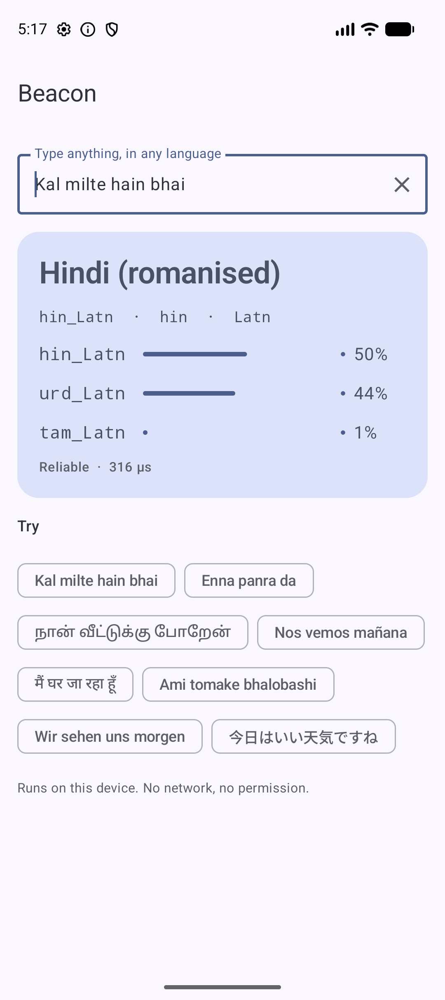
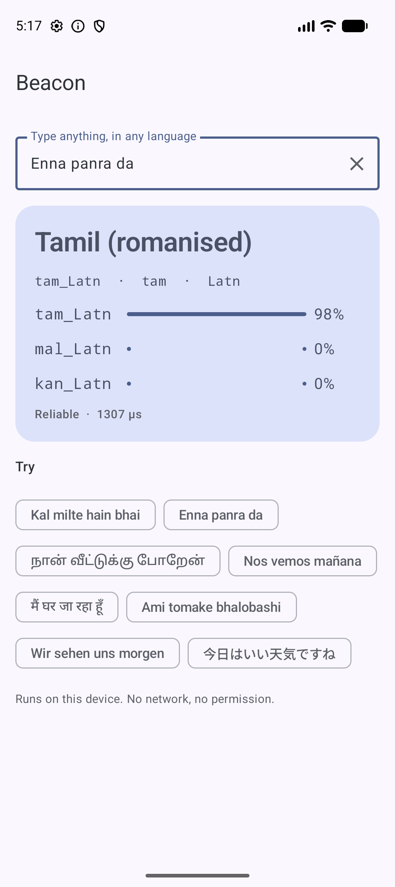
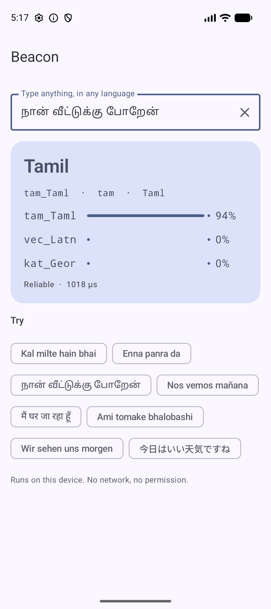
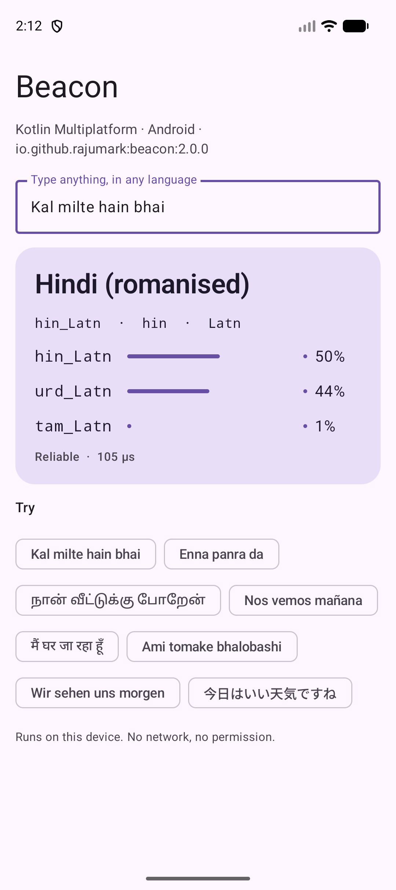
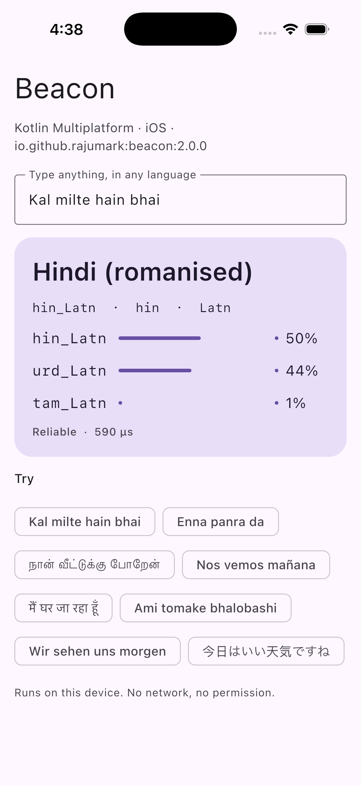
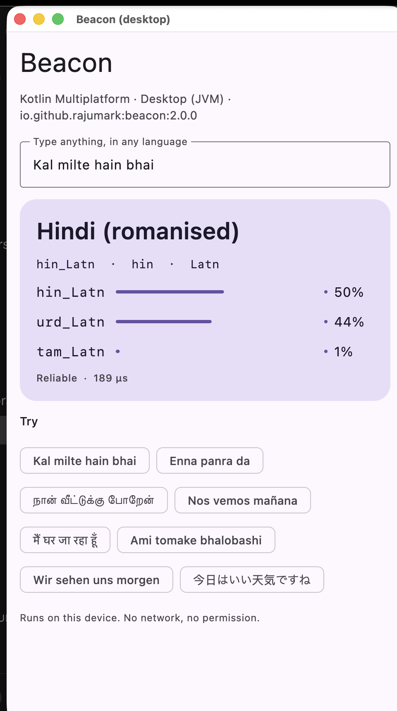
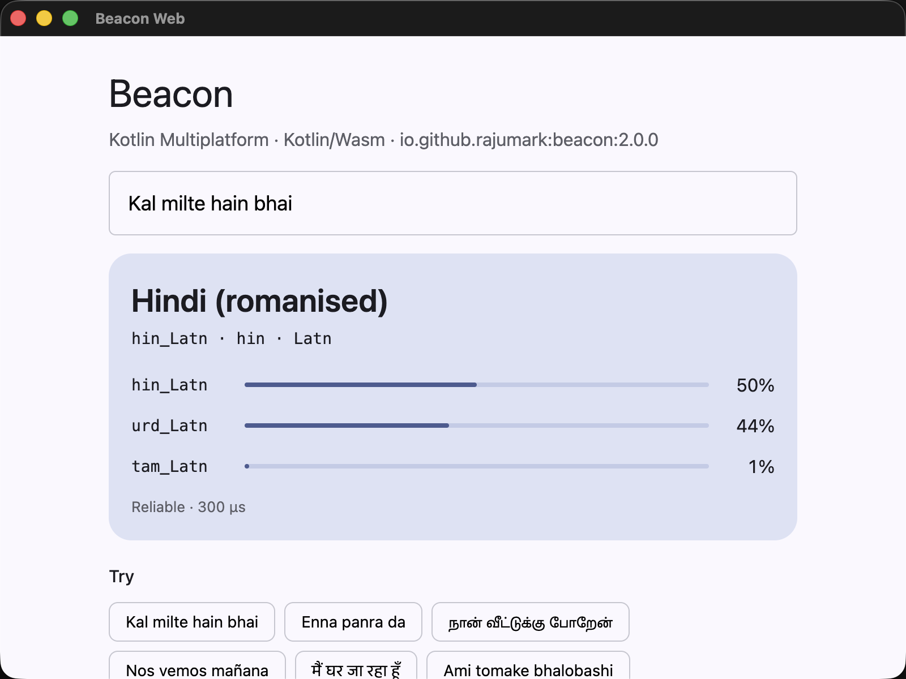

# Beacon 🗼

By Hoverfly. On-device language detection for **Kotlin Multiplatform**: Android, iOS, macOS, JVM desktop, JavaScript and WebAssembly. You give it any text, even a two-word chat message, and it tells you the language **and** the script. It also recognises romanised Indian languages like Hinglish and Tanglish.

```kotlin
import io.github.rajumark.hoverfly.beacon.Beacon

Beacon().use { beacon ->
    beacon.detect("Kal milte hain bhai").label   // "hin_Latn"  Hindi (romanised)
}
```

```
"Kal milte hain bhai"      → hin_Latn   Hindi (romanised)
"Enna panra da"            → tam_Latn   Tamil (romanised)
"நான் வீட்டுக்கு போறேன்"      → tam_Taml   Tamil
"Ami tomake bhalobashi"    → ben_Latn   Bengali (romanised)
"Nos vemos mañana"         → spa_Latn   Spanish
"😀 123"                    → und        (no letters to judge)
```

- **211 labels.** 195 language/script pairs, all 22 scheduled Indian languages, and 12 romanised South Asian languages (`hin_Latn`, `tam_Latn`, `urd_Latn`, `ben_Latn`, …).
- **No dependencies.** Inference is plain Kotlin. There is no ML Kit, TFLite or native code, so the library adds about 8.5 MB to an app.
- **Private and offline.** The model ships inside the library on every platform. There is no network, no permission and no telemetry.
- **Fast.** About 40–90 µs per text on JVM, Android, JS and Wasm once warm.
- **Identical everywhere.** Every platform is tested against the Python reference on 958 vectors: same normalization, same features, same label.

## Install

```kotlin
// build.gradle.kts: commonMain, or any platform source set
dependencies {
    implementation("io.github.rajumark:beacon:2.0.0")
}
```

It's on Maven Central, so no extra repository is needed. Gradle picks the right artifact for each platform:

| Platform | Artifact |
|---|---|
| Android (minSdk 21) | `beacon-android` |
| JVM desktop (Java 8+) | `beacon-jvm` |
| iOS device and simulator (arm64) | `beacon-iosarm64`, `beacon-iossimulatorarm64` |
| macOS (arm64) | `beacon-macosarm64` |
| JavaScript (browser, Node) | `beacon-js` |
| WebAssembly (browser, Node) | `beacon-wasm-js` |

The Android-only 1.x releases are on JitPack: `com.github.rajumark:beacon:v1.1.0`.

## Screenshots

The sample app on an emulator. Detection runs on the device, with no network round trip.

| Hinglish | Tanglish | Tamil |
|---|---|---|
|  |  |  |
| "Kal milte hain bhai" | "Enna panra da" | "நான் வீட்டுக்கு போறேன்" |

The KMP sample on each platform:

| Android | iOS | Desktop | Web (Wasm) |
|---|---|---|---|
|  |  |  |  |

## Use

```kotlin
import io.github.rajumark.hoverfly.beacon.Beacon

val beacon = Beacon()                   // loads the model: tens of ms, do it off the main thread, keep one instance

val r = beacon.detect("Kal milte hain bhai")
r.label        // "hin_Latn"
r.language     // "hin"   ISO 639-3
r.script       // "Latn"  ISO 15924
r.name         // "Hindi (romanised)"
r.confidence   // 0.50
r.isReliable   // confidence >= 0.5

beacon.candidates("Kal milte hain bhai", limit = 3)
// [hin_Latn 0.50, urd_Latn 0.44, tam_Latn 0.01]   Hindi vs Urdu in Latin script is a close call

beacon.detect("😀 123")                 // DetectedLanguage.UNDETERMINED ("und")

beacon.close()                          // frees the model's memory
```

`detect()` is thread-safe and fast enough to call on every keystroke.

With coroutines:

```kotlin
val beacon = withContext(Dispatchers.Default) { Beacon() }
```

From Java:

```java
try (Beacon beacon = new Beacon()) {
    DetectedLanguage r = beacon.detect("Kal milte hain bhai");
    String label = r.getLabel();   // "hin_Latn"
}
```

Upgrading from 1.x on Android: `Beacon(context)` still compiles in Kotlin (deprecated). The model no longer needs a `Context`, so switch to `Beacon()`. Java code must change `new Beacon(context)` to `new Beacon()`.

### API

| | |
|---|---|
| `Beacon()` | Loads the bundled model. `AutoCloseable`. |
| `detect(text)` | The most likely language. `DetectedLanguage.UNDETERMINED` when the text has no letters. |
| `candidates(text, limit = 3)` | The most likely languages, best first. Empty when the text has no letters. |
| `supportedLabels` | All 211 labels the model can return. |
| `DetectedLanguage(label, language, script, name, confidence)` | One result, plus `isReliable`. |

### Typical uses

Choose the keyboard or TTS voice, route a support ticket, pick a translation source language, show the right smart replies, filter content by language, or tell Hindi from Hinglish so the right model handles it.

## Accuracy

| test | Beacon | best other detector |
|---|---|---|
| FLORES-200, 64 shared languages | 98.5% | OpenLID-201 98.9% (158 MB), Lingua 98.2% (307 MB) |
| Short text (Tatoeba, ≤ 5 words) | **93.8%** | Lingua 89.0% |
| Chat messages (188 hand-written) | **88.3%** | MediaPipe 71.3% |
| Romanised Indic (human + real chat) | **93.0%** | MediaPipe 7.5%, others ~0% |

On an Android emulator, against Google ML Kit Language ID: chat 88.3% vs 71.3%, short text 93.2% vs 84.0%, romanised 92.1% vs 6.9%.

### Known limits

- One-word inputs are hard (65% accuracy). Three words or more reach 94–98%.
- Close pairs stay close: Bosnian/Croatian/Serbian (Latin), Indonesian/Malay, Cantonese vs Mandarin (Traditional), Awadhi/Bhojpuri vs Hindi.
- Very short romanised Bengali, Gujarati, Punjabi and Marathi chat is weaker than Hinglish or Tanglish.
- Romanised Hindi and romanised Urdu are the same spoken language (Hindustani). Treat `hin_Latn` and `urd_Latn` as one if your app doesn't need the difference.

## Sample apps

`sample/` is a separate Gradle build that uses the **published** library, never the source. It resolves `io.github.rajumark` only from Maven Local, or from Maven Central with `-PbeaconRepo=central`. It has a Compose Multiplatform app for Android, desktop and iOS, and a web page built for both Kotlin/JS and Kotlin/Wasm.

```bash
./gradlew :beacon:publishToMavenLocal
cd sample
./gradlew :androidApp:installRelease
./gradlew :desktopApp:run
./gradlew :webApp:wasmJsBrowserDevelopmentRun     # or :webApp:jsBrowserDevelopmentRun
open iosApp/iosApp.xcodeproj                       # run the iosApp scheme on a simulator
```

## Project layout

```
beacon/                        the library
  src/commonMain/              public API (Beacon, DetectedLanguage) and the model in plain Kotlin
                               (internal/: Featurizer, Network, UnicodeTables)
  src/{jvm,android,apple,js,wasmJs}Main/   the only platform code: NFKC normalization + model loading
  src/modelData/               beacon.beacon (int8 weights + labels)
  src/commonTest/              parity with Python on 958 vectors, API, latency; runs on every target
  src/jvmTest/                 checks the hand-written URL/letter matching against the 1.x java.util.regex
sample/                        demo apps using the published artifacts
scripts/GenTables.java         generates UnicodeTables.kt (character classes) so every platform agrees
docs/                          website (rajumark.github.io/beacon)
```

On JVM and Android the model ships as Java resources in the jar/AAR. Kotlin/Native and the web have no resources, so the build compiles it into the library (`generateEmbeddedModel`).

## Tests

```bash
./gradlew :beacon:jvmTest
./gradlew :beacon:testAndroidHostTest
./gradlew :beacon:connectedAndroidDeviceTest              # on a connected device/emulator
./gradlew :beacon:iosSimulatorArm64Test
./gradlew :beacon:macosArm64Test
./gradlew :beacon:jsNodeTest :beacon:jsBrowserTest
./gradlew :beacon:wasmJsNodeTest :beacon:wasmJsBrowserTest
```

The parity tests require identical normalization, identical feature ids and the same label as the Python reference on all 958 vectors, on every target. The current maximum probability difference is 1.3e-6.

## Publishing

See [PUBLISHING.md](PUBLISHING.md).

## Pricing & license

**Free for up to 10,000 monthly active devices.** You don't need an API key, an account or a license file: add the dependency and ship. It works in commercial apps too, with no limit on how often each device runs it.

| | Community | Commercial | Custom models |
|---|---|---|---|
| **Price** | Free | Contact us | Contact us |
| **For** | Products with up to 10,000 monthly active devices per platform | Products above 10,000 monthly active devices on any platform | A model trained for your own language, domain or task |
| **Includes** | Commercial use, unlimited calls, no key or sign-up | One license per product per model, direct support, early access to updates | Designed and trained by Hoverfly, shipped as a plain Kotlin library |

**How devices are counted.** A monthly active device is a device that runs Beacon at least once in a calendar month. The limit applies separately to each product, each platform (Android, iOS, web…) and each Hoverfly model. Once a product passes it, you have 30 days to get a commercial license. The library keeps working and never checks in with a server.

**Not allowed** under any tier (unless agreed in writing):

- selling or redistributing Beacon or its model on its own, or inside another SDK or library
- extracting, modifying, fine-tuning or retraining the model weights
- using the model or its outputs to train or distill another model
- reverse engineering the model or its file format
- offering it as a hosted API for others

**Custom models.** Hoverfly also designs and trains small, fast on-device models for your needs: moderation, classification, language detection, smart replies and more.

**Contact** for a commercial license or a custom model: [raju348636@gmail.com](mailto:raju348636@gmail.com) or **+91 63533 21951** (call or WhatsApp).

Full terms: [Hoverfly Community License](LICENSE). Versions 1.0.0 and earlier were released under Apache-2.0.
